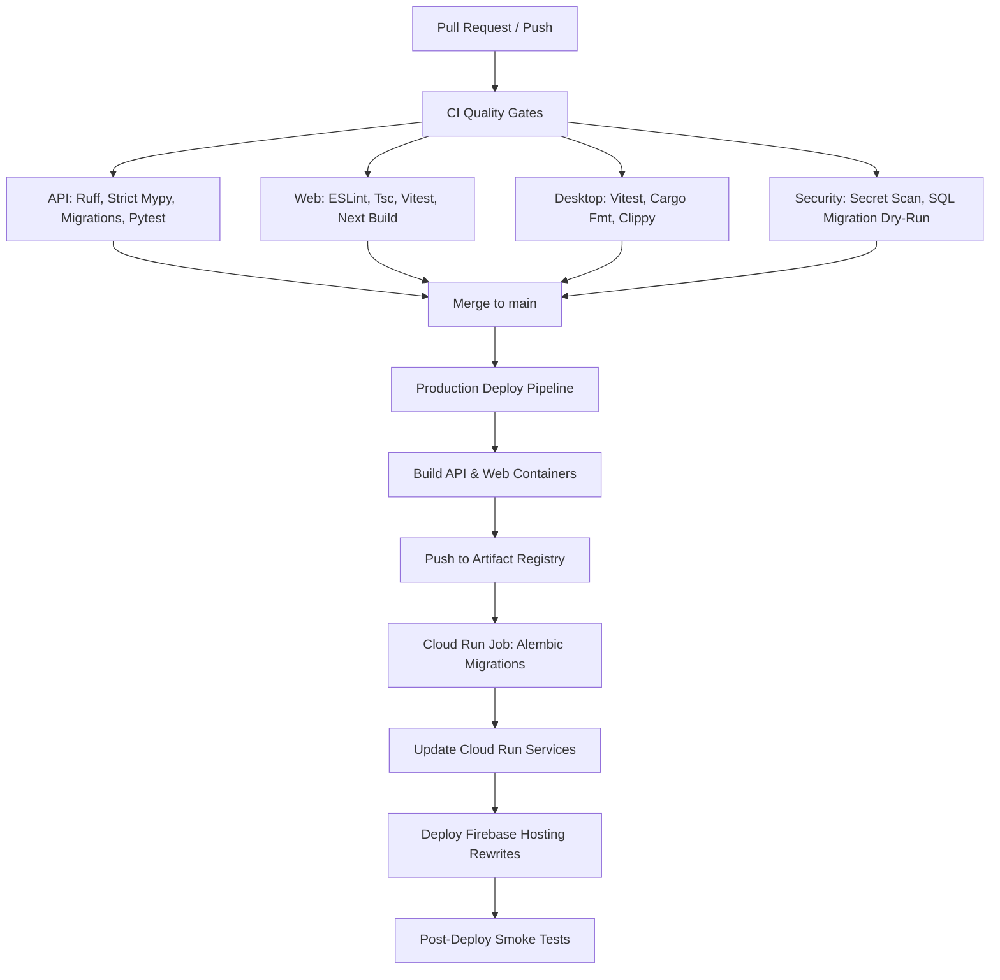

# CI/CD and Quality Gates Reference

## 1. Overview

Interview Ready employs a strict multi-tier CI/CD architecture to ensure code quality, type correctness, database migration safety, vulnerability prevention, and deterministic deployments.



---

## 2. Pull Request & CI Pipeline (`.github/workflows/ci.yml`)

The CI workflow triggers on every Pull Request targeting `main` and on direct commits to `main`. It enforces four parallel quality gates:

### A. API Quality Gate (`api-quality`)
- **Python Version**: 3.12 managed via `astral-sh/setup-uv@v5`
- **Services**: Live PostgreSQL 16 and Redis 7 test instances
- **Checks**:
  1. `uv run ruff check .` — Strict linting (E, F, I, UP, B, ASYNC)
  2. `uv run ruff format --check .` — PEP 8 formatting check
  3. `uv run mypy app` — Strict static type checking
  4. `uv run alembic upgrade head` — Live migration application on PostgreSQL
  5. `uv run pytest -v` — Automated unit and integration test suite

### B. Web Quality Gate (`web-quality`)
- **Node Version**: Node.js 22 LTS
- **Checks**:
  1. `npm run lint:web` — ESLint strict rules
  2. `npm run typecheck:web` — `tsc --noEmit`
  3. `npm run test:web` — Vitest unit test suite
  4. `npm run build:web` — Standalone Next.js 15 production build verification

### C. Desktop Quality Gate (`desktop-quality`)
- **Toolchains**: Node.js 22 + Rust Stable (`dtolnay/rust-toolchain@stable`)
- **Checks**:
  1. Desktop TypeScript typecheck (`tsc --noEmit`)
  2. Vitest unit test suite (`npm run test:desktop`)
  3. Vite frontend build (`npm run build:desktop`)
  4. Rust formatting check (`cargo fmt --check --manifest-path apps/desktop/src-tauri/Cargo.toml`)
  5. Rust Clippy warnings check (`cargo clippy --manifest-path apps/desktop/src-tauri/Cargo.toml -- -D warnings`)

### D. Security & Quality Baseline (`security-and-secrets`)
- **Secret Scanning**: Verifies that no `.env`, `.env.production`, or private key files are checked into version control.
- **Migration SQL Dry-Run**: Validates offline SQL generation (`uv run alembic upgrade head --sql`).
- **Dependency Audit**: Audits npm production packages for high/critical security advisories.

---

## 3. Production Deployment Pipeline (`.github/workflows/deploy.yml`)

Triggered automatically on commits to `main` or manually via `workflow_dispatch`.

### Deployment Sequence:
1. **Quality Gates Verification**: Runs comprehensive test suites prior to triggering builds.
2. **Containerization & Registry**:
   - Builds API container (`apps/api/Dockerfile`) with pinned Python 3.12-slim base and non-root user `appuser:10001`.
   - Builds Web container (`apps/web/Dockerfile`) with Alpine standalone output and non-root user `nextjs:1001`.
   - Tags with short Git SHA and pushes to Google Artifact Registry (`us-central1-docker.pkg.dev/$PROJECT_ID/interview-ready`).
3. **Database Migrations Execution**:
   - Runs a single-execution Cloud Run Job:
     ```bash
     gcloud run jobs execute interview-ready-migrations --region us-central1 --wait
     ```
   - *Prevents migration races across auto-scaled web/api instances.*
4. **Service Updates**:
   - Updates `interview-ready-api` Cloud Run service.
   - Updates `interview-ready-web` Cloud Run service.
5. **Firebase Hosting Deploy**:
   - Deploys Firebase Hosting rewrites (`/api/**` to API service, `/**` to Web service).
6. **Smoke Testing**:
   - Probes live URLs: `GET /health/live`, `GET /health/ready`, `GET /api/health`.

---

## 4. Desktop Release Safety Guard

> [!IMPORTANT]
> Desktop client installers (macOS `.dmg` / `.app`, Windows `.msi` / `.exe`, Linux `.AppImage` / `.deb`) are **NEVER published automatically** from web or backend CI triggers.

Automated desktop binary releases require explicit signing keys:
- **macOS**: Apple Developer Certificate + Apple Notarization credentials (`APPLE_CERTIFICATE`, `APPLE_CERTIFICATE_PASSWORD`, `APPLE_ID`, `APPLE_PASSWORD`, `APPLE_TEAM_ID`).
- **Windows**: Authenticode code-signing certificate (`WINDOWS_CERTIFICATE`, `WINDOWS_CERTIFICATE_PASSWORD`).
- **Tauri Upgrades**: Cryptographic signing private key (`TAURI_SIGNING_PRIVATE_KEY`).

Desktop binaries must only be built and released via a dedicated release workflow once these cryptographic credentials are provisioned in GitHub Actions environment secrets.
