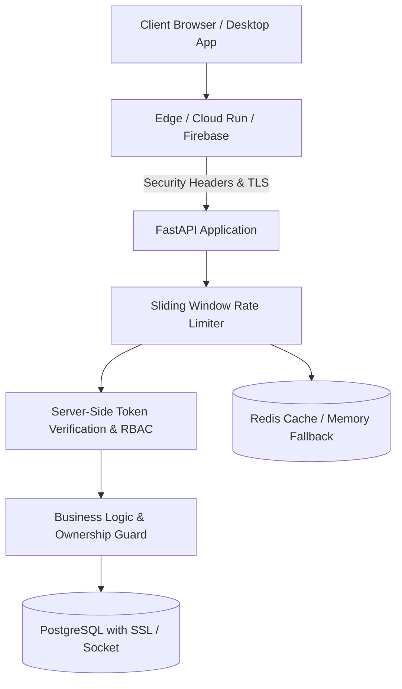

# Security Baseline & Hardening Specification

## 1. Security Architecture Overview

Interview Ready follows a defense-in-depth security model across the API, Web frontend, Desktop client, and Cloud infrastructure.

---

## 2. HTTP Security Headers

Security headers are enforced at both the application level and edge hosting layers:

| Header | Backend API Value | Web Application Value | Purpose |
| :--- | :--- | :--- | :--- |
| **`Content-Security-Policy`** | `default-src 'none'; frame-ancestors 'none'; sandbox;` | `default-src 'self'; script-src 'self' 'unsafe-eval' 'unsafe-inline' ...` | Prevents XSS, data injection, and malicious clickjacking. |
| **`Strict-Transport-Security`** | `max-age=31536000; includeSubDomains; preload` | `max-age=31536000; includeSubDomains; preload` | Enforces modern HTTPS connections exclusively. |
| **`X-Content-Type-Options`** | `nosniff` | `nosniff` | Prevents MIME-sniffing attacks. |
| **`X-Frame-Options`** | `DENY` | `DENY` | Disallows embedding within external `<iframe>` elements. |
| **`Referrer-Policy`** | `strict-origin-when-cross-origin` | `strict-origin-when-cross-origin` | Strips path and query data when navigating cross-origin. |
| **`Permissions-Policy`** | `accelerometer=(), camera=(), geolocation=(), ...` | `camera=(self), microphone=(self), display-capture=(self)` | Restricts hardware access to authorized features only. |
| **`Cross-Origin-Opener-Policy`** | `same-origin` | `same-origin` | Isolates browsing contexts to prevent Spectre-like attacks. |
| **`Cross-Origin-Resource-Policy`**| `same-site` | `same-site` | Restricts resource loading across origins. |

---

## 3. Rate Limiting Strategy

Rate limiting prevents Denial of Service (DoS), brute force credential spraying, ticket hoarding, and slot exhaustion.

### Sliding Window Implementation
- **Storage**: Redis Sorted Sets (`ZSET`) using timestamp scoring (`now - window_seconds`).
- **Identifier Strategy**:
  - **Authenticated Users**: Keyed by `u:{user_id}` (e.g. `ratelimit:reserve_slot:u:550e8400...`).
  - **Unauthenticated / Public**: Keyed by `ip:{client_ip}` extracted from `X-Forwarded-For` or socket host.
- **Fail-Safe Fallback**: If Redis is offline or undergoing maintenance, an in-memory thread-safe sliding window maintains rate limiting uninterrupted.

### Endpoint Policies:

| Action / Endpoint | Rate Limit | Window | Strategy | Objective |
| :--- | :--- | :--- | :--- | :--- |
| **Desktop Ticket Mint** (`/auth/mint-desktop-ticket`) | 10 reqs | 60s | User / IP | Prevent automated bulk minting of single-use tokens. |
| **Desktop Ticket Exchange** (`/auth/exchange-desktop-ticket`) | 15 reqs | 60s | IP | Mitigate token brute-forcing and rapid ticket replay. |
| **Booking Reservation** (`/bookings/reserve`) | 10 reqs | 60s | User / IP | Prevent artificial slot hoarding and denial of inventory. |
| **Checkout Dispatch** (`/payments/{id}/checkout`) | 10 reqs | 60s | User / IP | Protect payment gateways against rapid checkout spam. |
| **Public Discovery / Search** (`/interviewers`) | 60 reqs | 60s | User / IP | Defend against aggressive scraping and database load. |
| **Admin Searches** (`/admin/users`, `/admin/audit-logs`) | 60 reqs | 60s | User / IP | Guard sensitive administrative search queries. |

### Rate Limit Response Headers:
- `X-RateLimit-Limit`: Maximum requests permitted in window.
- `X-RateLimit-Remaining`: Remaining allowance in current window.
- `X-RateLimit-Reset`: Unix epoch timestamp when limit completely resets.
- When limit is exceeded: **HTTP 429 Too Many Requests** with `Retry-After: <seconds>` and standard `ApiError` envelope.

---

## 4. Authentication & Authorization Principles

1. **Server-Side Token Verification**: Every Firebase ID token is cryptographically verified server-side with `check_revoked=True`.
2. **Never Trust Client-Supplied Claims**: Application permissions are stored strictly in PostgreSQL `users.role` and `users.status`. Client token claims do not grant administrative access.
3. **Account Status Enforcement**: Active checks ensure `SUSPENDED` or `DISABLED` accounts are rejected on every authenticated call.
4. **Ownership Enforcement**: `ensure_owner_or_role` asserts resource ownership (e.g. only candidate or interviewer assigned to booking can access sessions or rubrics).
5. **Ephemerality**: Desktop tickets have 60-second TTLs and are consumed atomically (`GETDEL`). Session JWTs have short lifetimes and LiveKit tokens are room-scoped.
